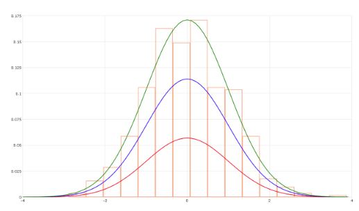
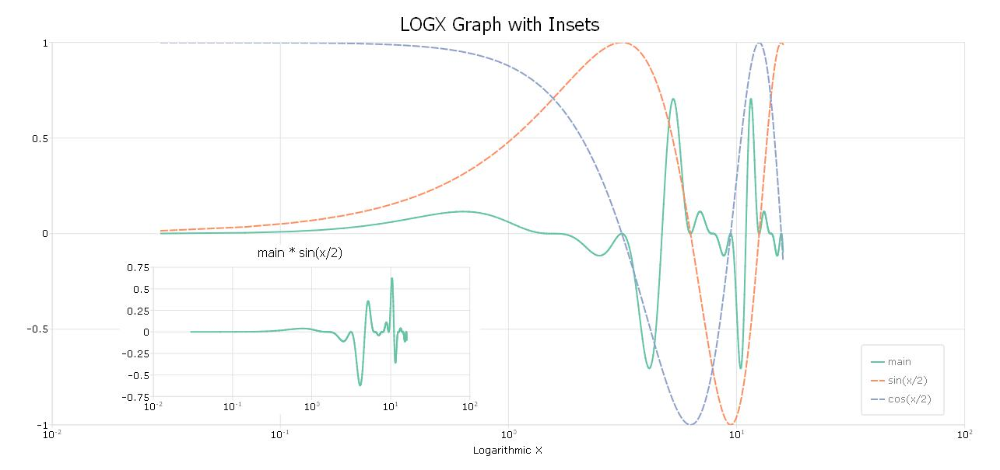
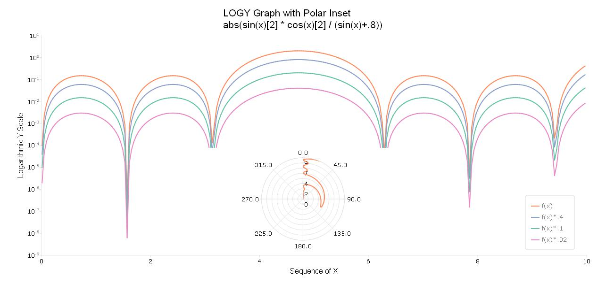
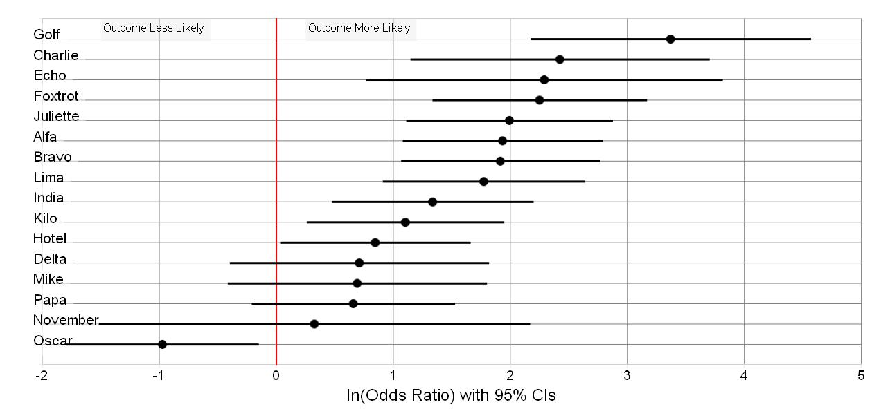
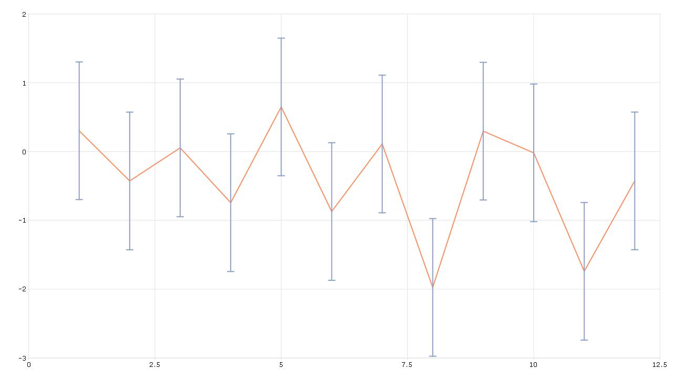
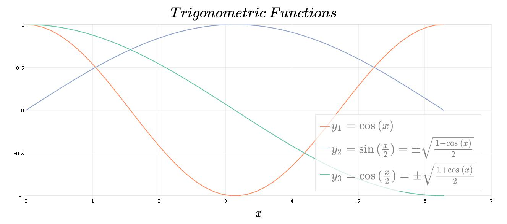

# GAUSS Plot Library
The GAUSS plot library focuses on the graphic functionality of GAUSS. It provides example images of plots created in GAUSS along with the GAUSS code used to create the plots. Together these tools demonstrate how to create and format a variety of types of graphs in GAUSS. This library illustrates both fundamental graphing features as well as advanced plotting features in GAUSS, such as color schemes, graph annotation, and canvas sizing.

## Getting Started
### Prerequisites
The program files require a working copy of GAUSS 18+. Many can be run on earlier versions with some small revisions.

### Installing
1. Images and descriptions of graph examples are stored in the "doc" directory as .md files. These files contain links to the GAUSS program files that are used to create the graphs.
2. The program files are stored as .gss files in the "src" directory. The naming structure is consistent between the .md files and the .gss files. For example, the code for creating the graph illustrated in the file "doc/bar_add_error_bars.md" is found in file "src/bar_add_error_bars.gss".
3. If the program file contains data it is stored in the "data" directory.
4. These program files and their associated data files can be downloaded directly into the examples directory in the GAUSS home directory.

## Coverage
|Graph|Image|
|:----|:----|
|[Stock portfolio area plot](docs/area_stock_portfolio.md)||
|[Bar graph with error bars](docs/bar_add_error_bars.md)||
|[Histogram with added line plot](docs/histogram_line_plot.md)||
|[Log X-axis with Inset Plot](docs/logx_with_inset.md)||
|[Log Y-axis with Inset Plot](docs/logy_with_inset.md)||
|[Horizontally plotted odds ratios](docs/odds_ratio_horizontal.md)||
|[Polar rose plot](docs/polar_rose.md)||
|[Scatter plot with a trend line](docs/scatter_trend_line_plot.md)||
|[Annotated time series plot](docs/time_series_annotated.md)||
|[XY plot with added error bars](docs/xy_add_error_bars.md)||
|[XY plot with LaTex labels](docs/xy_latex.md)||

## Authors
Erica Clower  
[email us](mailto:eclower@aptech.com)  
[LinkedIn](https://linkedin.com/in/ericaclower)  
[Aptech Systems, Inc](https://www.aptech.com/)
