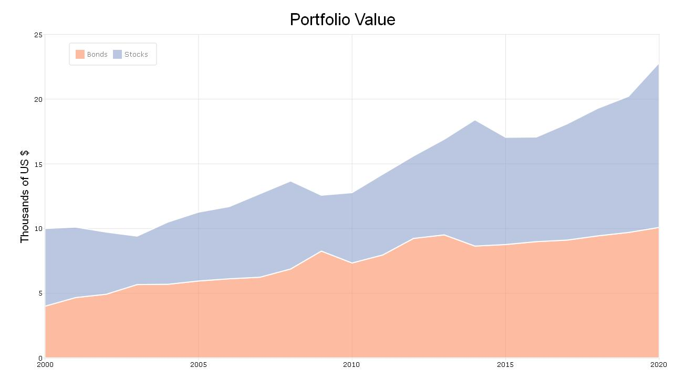

# GAUSS Area Plot

## Description
This file will generate an area graphusing hypothetical stock and bond price data. The data is directly input into a GAUSS matrix in the program file. A number of plot customization options are demonstrated including:
1. Creating a matrix in GAUSS
2. Using a `for` loop in GAUSS
3. Using a `plotControl` structure to customize graph features including
  *  Setting plot title options including font and font size
  *  Setting X and Y axis label options including font and font size
  *  Setting area fill type and opacity
  *  Adding a legend to a GAUSS plot

## Example

## Source Code
Find the code for generating this graph [here](https://github.com/ec78/gauss-plot-library/blob/master/src/area_stock_portfolio.gss)
