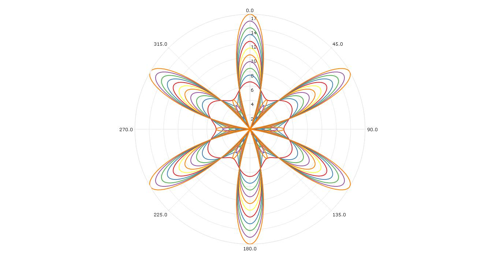

# GAUSS Polar Rose

## Description
This file will generate a polar graph using the GAUSS `plotPolar` procedure. The data is generated in the program. A number of plot customization options are demonstrated including:
1. Using a `plotControl` structure to customize graph features including
  *  Setting the plot line colors using a pre-built color scheme
2.  Using `getColorPalette` to change plot color scheme

## Example

## Source Code
Find the code for generating this graph [here](https://github.com/ec78/gauss-plot-library/blob/master/src/polar_rose.gss)
